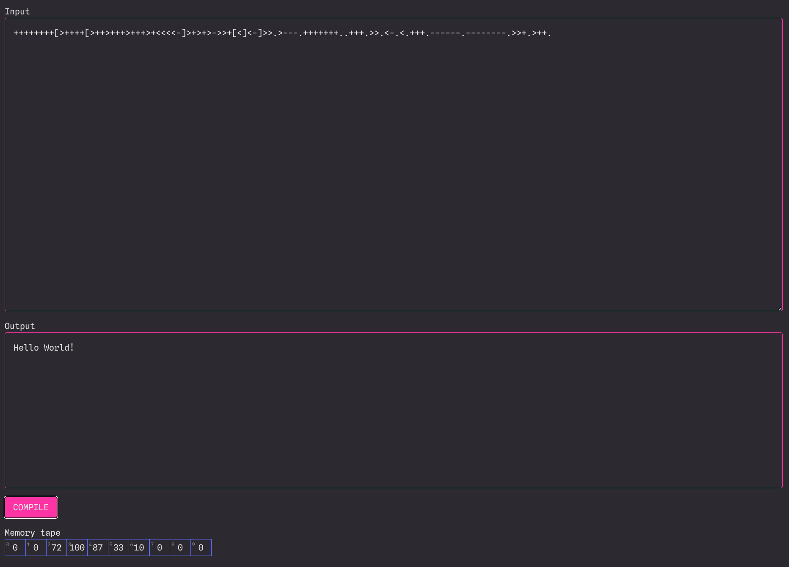

nipatiitti: @workspace this project was a valuation for the state of vanilla typescript web development in 2022. It's a brain fuck compiler made with no library dependencies except esbuild for development server and production build. Write me a README.md file and include it's content inside a 1 code block in markdown format. Add the /assets/image.png frontpage image also

Workspace: ```markdown
# Brainfuck Compiler

This project is a valuation for the state of vanilla TypeScript web development in 2022. It's a Brainfuck compiler made with no library dependencies except esbuild for the development server and production build.




## Getting Started

### Prerequisites

- Node.js >= 16.0.0
- Yarn or npm

### Installation

1. Clone the repository:
   ```sh
   git clone <repository-url>
   cd <repository-directory>
   ```

2. Install dependencies:
   ```sh
   yarn install
   # or
   npm install
   ```

### Development

To start the development server, run:
```sh
yarn dev
# or
npm run dev
```

### Production Build

To create a production build, run:
```sh
yarn build
# or
npm run build
```

### Analyze Build

To analyze the production build, run:
```sh
yarn analyze
# or
npm run analyze
```
